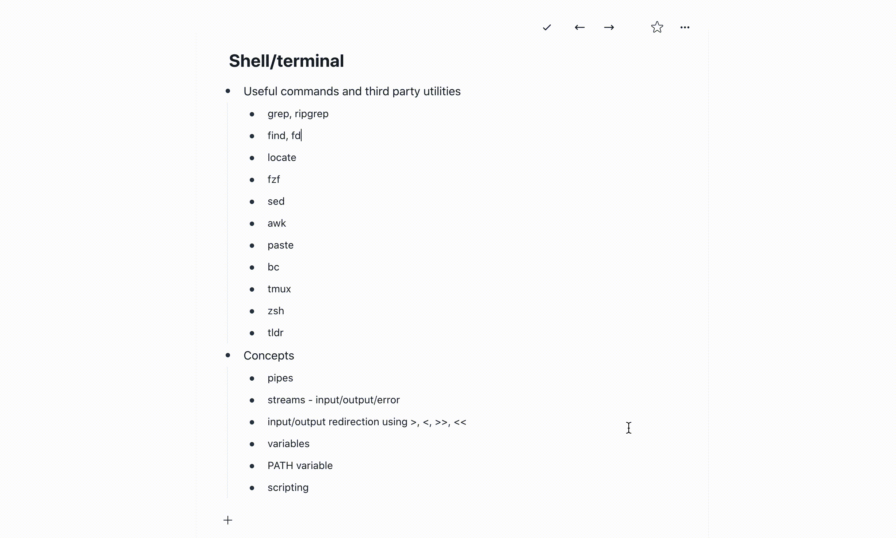

`deepnotes-editor` is the editor used in [deepnotes.in](https://deepnotes.in).
It's a clone of the [workflowy.com](https://workflowy.com) editor written in
[draft-js](https://draftjs.org/). `deepnotes-editor` can be used as a react
component.

Here's a gif of how it works - 



Usage -

Install `deepnoter-editor`

```shell
npm install deepnotes-editor # or yarn add deepnotes-editor
```

Use anywhere in your react codebase

```
import Editor from 'deepnotes-editor';

// it will look like it's not working without the css
import 'deepnotes-editor/deepnotes-editor.css';

// inside your dom heirarchy somewhere
<div>
  <Editor onChange={editorState => saveToDb(editorState)} />
</div>
```

## How to save editor state?
You can use draft-js utilities to convert the `EditorState` returned from
`onChange` prop. The prop returned is an [immutable-js](https://immutable-js.github.io/immutable-js/) value.


```
import { convertToRaw } from 'draft-js'

function saveToDb(editorState) {
  const contentState = JSON.stringify(convertToRaw(contentState)),

  saveToDbOrLocalStorage(contentState);
}
```

## How to get back editor state from the saved content state?
You can use `convertFromRaw` utility from `draft-js` to convert the content
state json back to immutable-js `EditorState`. You have to use the
`createDecorators` function which comes with `deepnotes-editor` so that the
hashtags, links and code are highlighted properly.


```
import DeepnotesEditor, { createDecorators} from 'deepnotes-editor';
import 'deepnotes-editor/deepnotes-editor.css';

const contentState = convertFromRaw(JSON.parse(backupContent));
const editorState = EditorState.createWithContent(
  contentState,
  createDecorators()
);

// inside your render function
return <div>
  <DeepnotesEditor
    initialEditorState={editorState}
    onChange={(changedEditorState) => saveToDb(changedEditorState)}}
  />
</div>
```

### Customization or configuration
These are the props `deepnotes-editor` accepts

#### initialEditorState
This prop can be used to initialize the editor with some saved state. The state
is of the type `EditorState` from `draft-js`. See `draft-js` documentation for
more details - https://draftjs.org/docs/quickstart-api-basics#controlling-rich-text

P. S. - This component is not a controlled component. But if you change the
variable you send to `initialEditorState`, it will set that as the new editor
state. 

#### initialZoomedInItemId
If we want the editor to open zoomed in on some item. Very useful if you map the
zoomedin items with urls and then if a user pastes or goes to a particular item
directly, the editor can be also zoomed in to that item.

#### searchText
If you want to filter the items by some text

#### onChange
`onChange` is a function which is called with the new `EditorState` on every
change. This can be used to save the new `EditorState` to local storage or to
some persistent database.

#### onRootChange
This prop is called if the user zooms into a particular item. Please checkout
workflowy.com to understand what zoom in means.

#### onBookmarkClick
If a user wants to bookmarks a particular zoomed in item. This can be used to
build a bookmarking feature where the user can zoom to any of the bookmarked
item.

## Development
This project was built using
[https://github.com/formium/tsdx](https://github.com/formium/tsdx). Given below
are some instructions on how you get build the project and get the example
running.

## Commands

The recommended workflow is to run TSDX in one terminal:

```bash
npm install # or yarn install
npm start # or yarn start
```

This builds to `/dist` and runs the project in watch mode so any edits you save inside `src` causes a rebuild to `/dist`.

Then run the example inside another:

```bash
cd example
npm i # or yarn to install dependencies
npm start # or yarn start
```

The default example imports and live reloads whatever is in `/dist`, so if you are seeing an out of date component, make sure TSDX is running in watch mode like we recommend above. **No symlinking required**, [we use Parcel's aliasing](https://github.com/palmerhq/tsdx/pull/88/files).

To do a one-off build, use `npm run build` or `yarn build`.

To run tests, use `npm test` or `yarn test`.

## Configuration

Code quality is [set up for you](https://github.com/palmerhq/tsdx/pull/45/files) with `prettier`, `husky`, and `lint-staged`. Adjust the respective fields in `package.json` accordingly.

### Jest

Jest tests are set up to run with `npm test` or `yarn test`. This runs the test watcher (Jest) in an interactive mode. By default, runs tests related to files changed since the last commit.

## Deploying the Playground

The Playground is just a simple [Parcel](https://parceljs.org) app, you can deploy it anywhere you would normally deploy that. Here are some guidelines for **manually** deploying with the Netlify CLI (`npm i -g netlify-cli`):

```bash
cd example # if not already in the example folder
npm run build # builds to dist
netlify deploy # deploy the dist folder
```

Alternatively, if you already have a git repo connected, you can set up continuous deployment with Netlify:

```bash
netlify init
# build command: yarn build && cd example && yarn && yarn build
# directory to deploy: example/dist
# pick yes for netlify.toml
```

## Publishing to NPM

We recommend using [np](https://github.com/sindresorhus/np).
